# Kurs med Capra Consulting AS


# Oppgave

1. Konfigurer en Alexa skill for å hente kodeordet til teamet deres fra en Lambda-funksjon
2. Utvid kodebasen, Alexa skill-en og Lambda-funksjonen til å sende inn kodeordet deres
3. Når riktig kodeord blir sendt inn vil lampen fremst i rommet lyse opp i teamet sin farge.
4. Det vanker premie for første team som blir ferdig

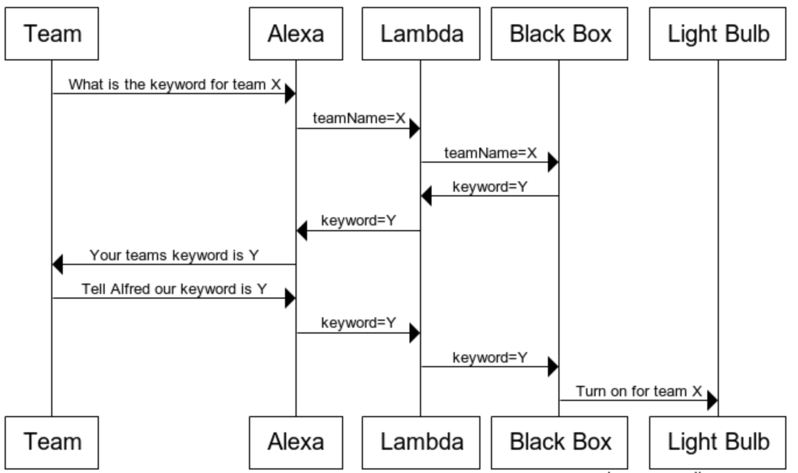

# Forutsetninger

* Java 8
* Maven
* Git

# Hvordan sette opp en Alexa skill

Gå til https://www.developer.amazon.com/alexa og logg inn med brukernavn og passord som dere har fått utdelt.

Trykk på *Create Skill*


Fyll ut *Skill Name*, for eksempel *Alfred*

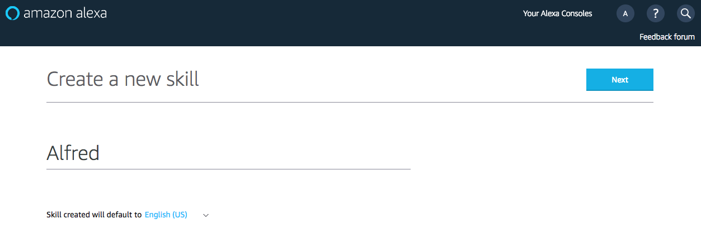

Trykk *Next* og velg *Custom* som model for skill-en

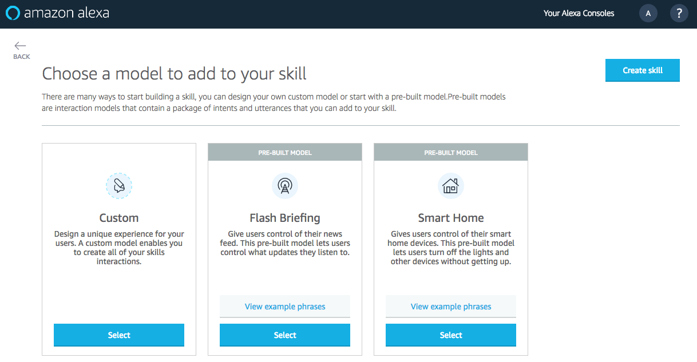

Trykk *Create Skill*. Dette vil ta dere til skill-siden i Alexa sin konsoll

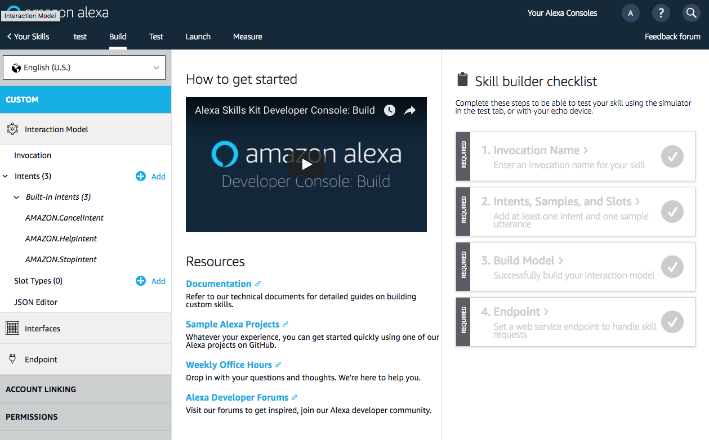

Gå gjennom punktene 1-4 under "Skill builder checklist" for å sette opp skill-en. Begynn med å sette opp *Invocation* som er hva dere sier til Alexa for å trigge skill-en deres.

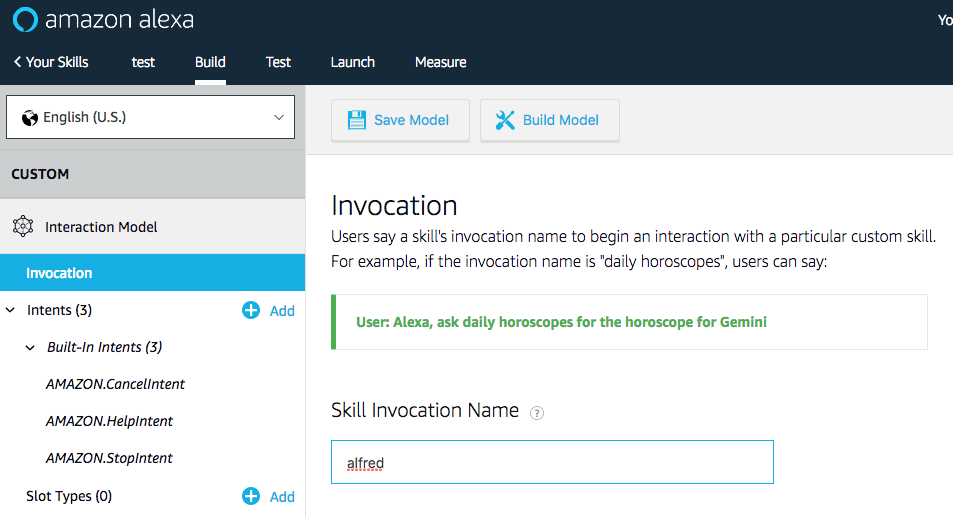

Sett deretter opp *intents*. Tenk på *intents* som endepunkter for Alexa. Her trenger vi et som heter *provideKeyword* og et som heter *requestKeyword*

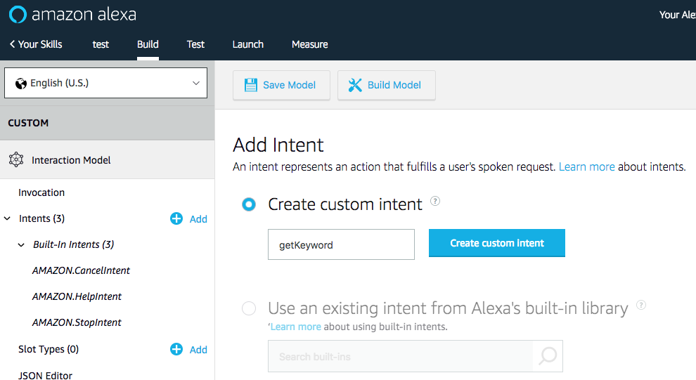

For hver *intent* trenger vi "utterances" som er setninger som trigger endepunktene. Dette er altså det vi vil si til Alexa for å trigge skill-en. En *intent-slot* kan ses på som en parameter og kan bli brukt videre i koden, for eksempel som query-parametere i en URL

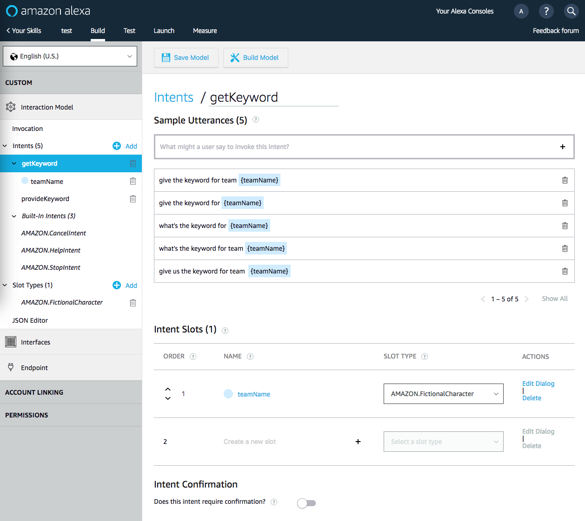

*Interfaces* trenger man ikke å røre, men vi må sette opp *endpoint* for Alexa-skillen. Dette vil være endepunktet som Alexa gjør et request mot når skill-en blir trigget. Endepunktet vi skal bruke her er en AWS Lambda funksjon, så la oss sette opp det først.

# Hvordan sette opp en AWS Lambda-funksjon

Gå til https://console.aws.amazon.com/console/home?region=us-east-1 og logg inn med brukernavn og passord som dere har fått utdelt. Dette er ikke samme brukernavnet og passordet som til Alexa-konsollen. Når dere har logget inn trykker dere *Services* i meny-en på toppen.

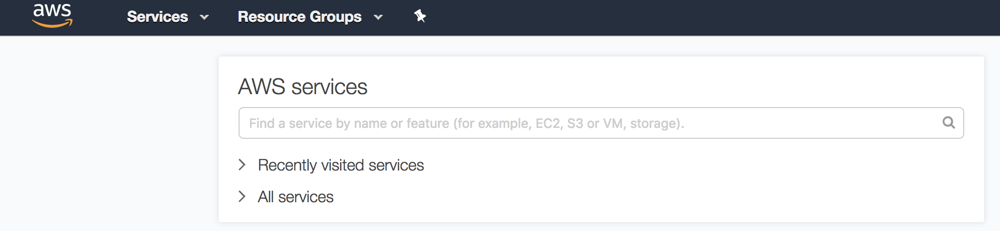

Velg *Lambda* i meny-en som dukker opp.

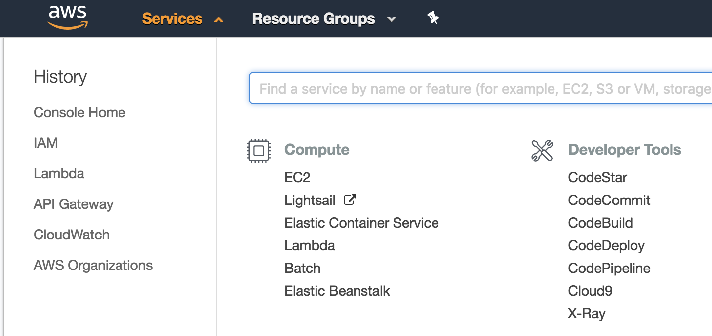

Trykk på *Create function* for å lage en AWS Lambda funksjon

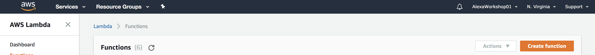


Sett opp følgende felter for funksjonen
* **Name**: CapraWorkshop
* **Runtime**: Java 8
* **Role**: Create a custom role
  
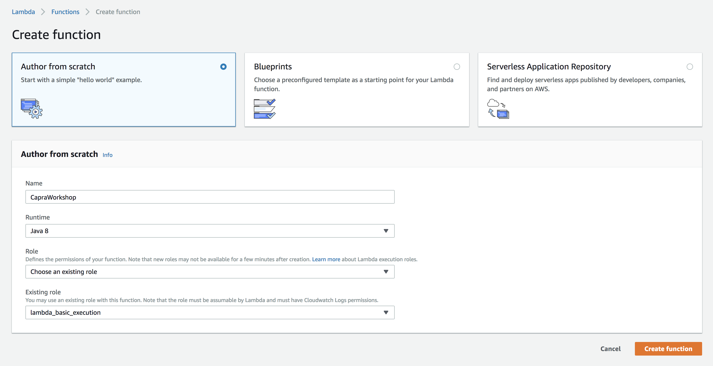
  
Når dere setter feltet Rolle" til "customer role" vil dere bli sendt til en IAM-side (Identity and Access Management) der man setter rettigheter til rollen. La det stå som det gjør og trykk *Allow*

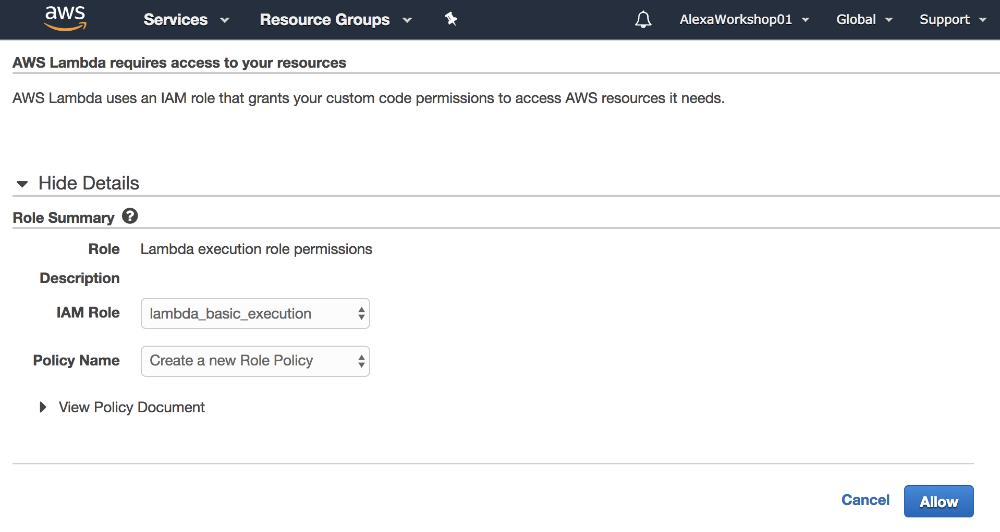

Bygg Java-koden som er inkludert i dette repo-et (se egne instrukser). Last deretter opp Java-koden som skal kjøres av Lambda-funksjonen (velg den som heter "...with-dependencies.jar").
Sett *Handler* til verdien `no.capra.workshop.CapraWorkshopRequestHandler`. Husk å lagre Lambda-funksjonen.

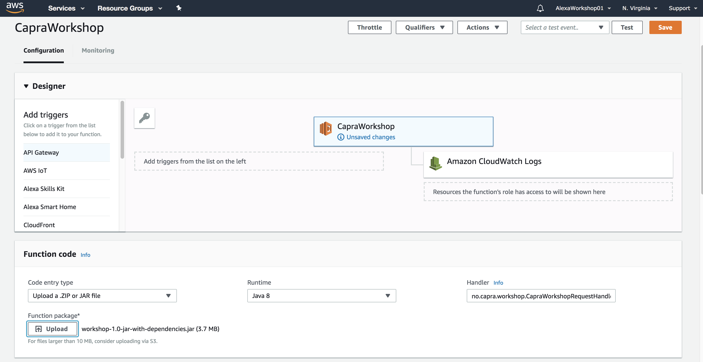

Fra menyen under "Add triggers" velger dere *Alexa Skill Kit*. Her er det bare å lime inn ID-en til skillen deres og trykke "Save".

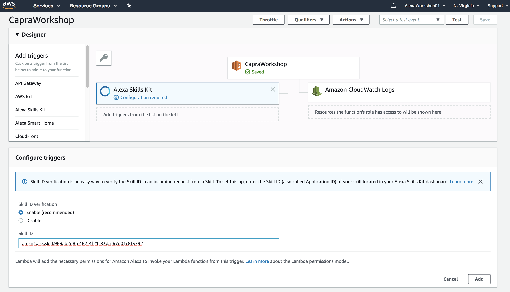

Kopier ned ARN-en (Amazon Resource Name) til Lambda funksjonen og gå tilbake til Alexa-konsollen

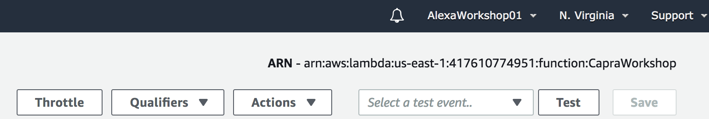

I Alexa-konsollen velger dere *Endpoint* i menyen til høyre. Under feltet *Default region* her limer dere inn ARN-en til Lambda-funksjonen og lagrer.

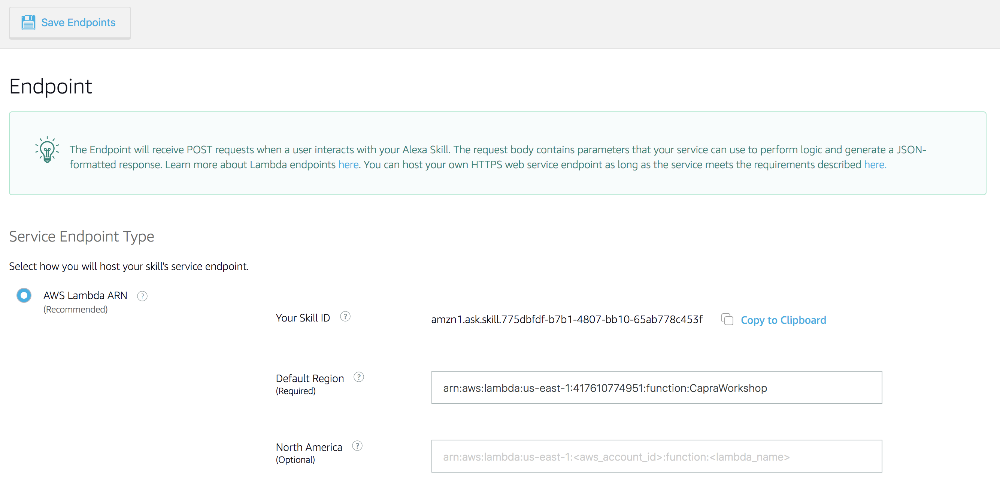

Nå skal dere kunne snakke til Echo-høytaleren deres og på den måte trigge koden som ligger i AWS sin lambda funksjon. 

# Bygg koden før opplastning til AWS

Koden bygges ved hjelp av Maven. Dette må installeres hvis det ikke allerede er installert.
Kjør følgende kommando:

```
$ ./mvnw clean package
```

Nå ligger det en fil i mappen `target` som heter `workshop-1.0-jar-with-dependencies.jar`. Dette er koden som skal lastes opp til AWS Lambda-funksjonen.
